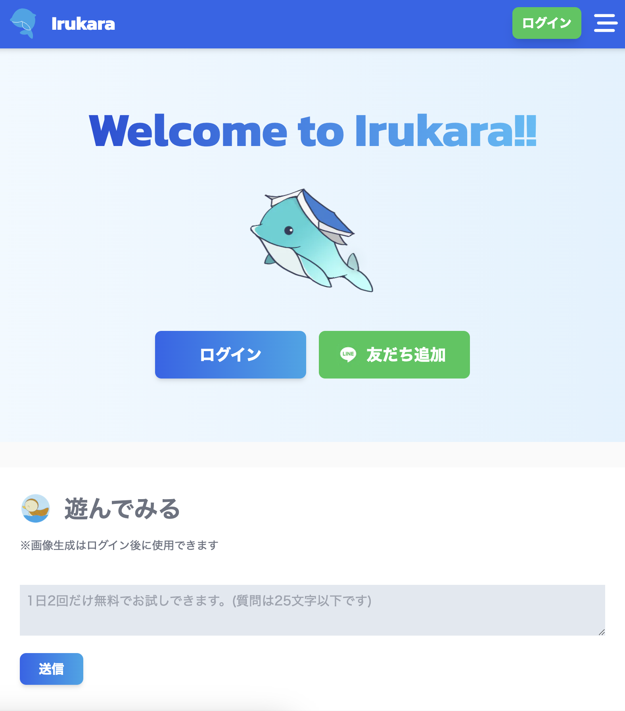
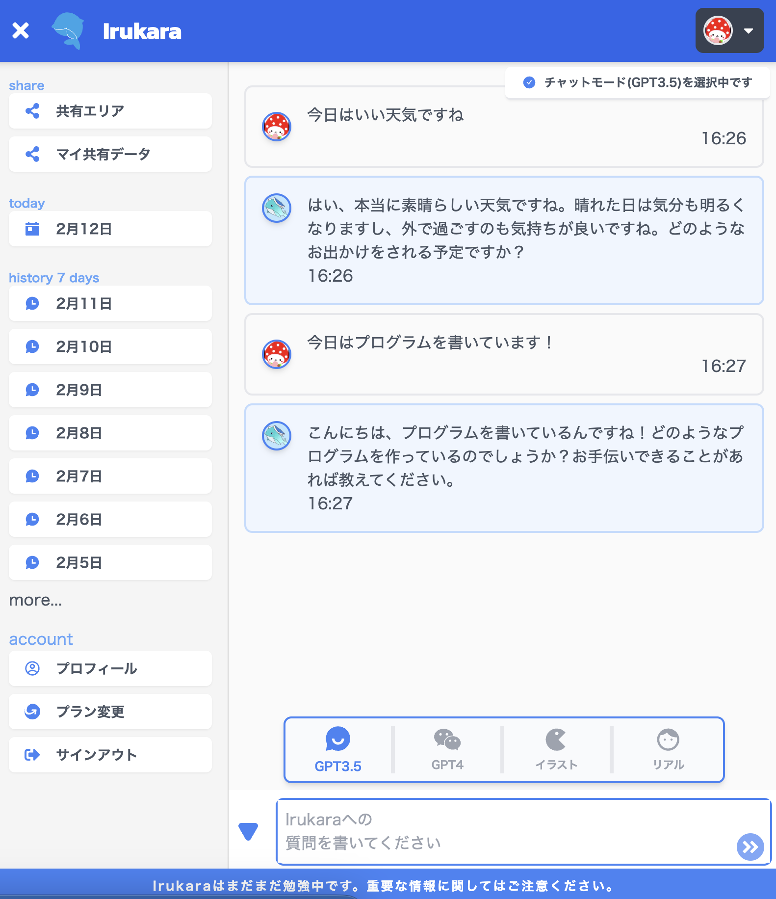
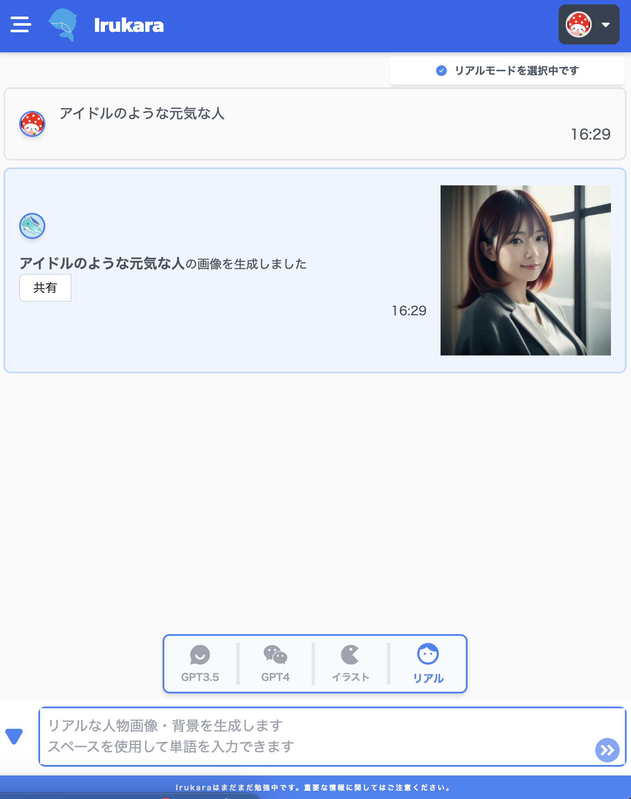

# Irukara.net フロントエンド

```
npm isntall
npm run local
```

## 構成

OpenAI, StableDiffusion をブラウザで使用する個人開発プロジェクトです。
もくもくと開発をしています。

|                | フレームワーク                                            | 言語       |
| :------------- | :-------------------------------------------------------- | :--------- |
| フロントエンド | Next.js                                                   | Typescript |
| バックエンド   | Lambda                                                    | Typescript |
| データベース   | Dynamodb                                                  |            |
| インフラ       | Lambda, ApiGateway, EventBridge スケジューラ, S3, upstash |            |
| デプロイ       | フロントは、github actions で vercel にデプロイしてます   |            |

※バックエンドに関しては、公開してないです。

<br>

### イメージ画像

- トップ
  

- チャット画面
  

- リアル画像生成
  
